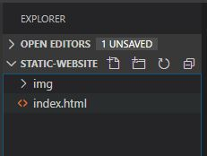
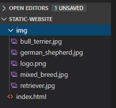

# Add Content to an HTML Page

## In this lesson we will add our content to the index.html page.

### Page Preview

- In Visual Studio , click on the **Preview** icon.


- In this way, you can preview the rendered HTML page as you add your code


### Add Images

- In the project use the new folder icon to add a folder


- Name the folder **img**



- Download the .zip folder from [Tutorial Resources](https://github.com/rcl-coding/tutorial-resources/archive/master.zip)

- Unzip the folder and copy the images from the 'static-website' folder to your img folder



### Header

- Remove the **p** element from the body

- Add a **header** tag in the body as follows

```html
<!doctype html>
<html lang="en">

<head>

    <meta charset="utf-8">
    <meta name="viewport" content="width=device-width, initial-scale=1, shrink-to-fit=no">
    <meta name="description" content="Adopt a dog from us today">
    <title>Dog Adoption Agency</title>

</head>

<body>
    <header>
        
        <h1>Adopt a Pet</h1>
    </header>
</body>

</html>
```

The **header** element contains an **img** (image) element and a **h1** (text H1 header) element.

The **img** element has ad **id** attribute set to 'log' and a **src** attribute set to the relative path to the logo image.

### Navigation 

- Under the Header element add a **nav** element as follows

```html
<!doctype html>
<html lang="en">

<head>

    <meta charset="utf-8">
    <meta name="viewport" content="width=device-width, initial-scale=1, shrink-to-fit=no">
    <meta name="description" content="Adopt a dog from us today">
    <title>Dog Adoption Agency</title>

</head>

<body>
    
    <header>
        
        <h1>Adopt a Pet</h1>
    </header>

    <nav>
        <ul>
            <li><a href="index.html">Home</a></li>
            <li><a href="contact.html">Contact</a></li>
            <li><a href="about.html">About</a></li>
        </ul>
    </nav>

</body>

</html>
```

The **nav** element contains an unordered (**ul**) list (**li**) of links (**a**). Notice how the **a** element is nested in each **li** element. And each **li** element is nested in the **ul** element.

These links will comprise the navigation for our website.

### Section

- Under the nav element, add a **section** element

```html
<!doctype html>
<html lang="en">

<head>

    <meta charset="utf-8">
    <meta name="viewport" content="width=device-width, initial-scale=1, shrink-to-fit=no">
    <meta name="description" content="Adopt a dog from us today">
    <title>Dog Adoption Agency</title>

</head>

<body>

    <header>
        
        <h1>Adopt a Pet</h1>
    </header>

    <nav>
        <ul>
            <li><a href="index.html">Home</a></li>
            <li><a href="contact.html">Contact</a></li>
            <li><a href="about.html">About</a></li>
        </ul>
    </nav>

    <section>

    </section>

</body>

</html>
```

In the section element, add the following code to create a description for the pet.

```html
<!doctype html>
<html lang="en">

<head>

    <meta charset="utf-8">
    <meta name="viewport" content="width=device-width, initial-scale=1, shrink-to-fit=no">
    <meta name="description" content="Adopt a dog from us today">
    <title>Dog Adoption Agency</title>

</head>

<body>

    <header>
        
        <h1>Adopt a Pet</h1>
    </header>

    <nav>
        <ul>
            <li><a href="index.html">Home</a></li>
            <li><a href="contact.html">Contact</a></li>
            <li><a href="about.html">About</a></li>
        </ul>
    </nav>

    <section>

        <div id="pet_1">
            <div>
                <p>German Shepherd</p>
                
            </div>
            <div>
                <p>This dog is intelligent and can make good guard dogs.</p>
            </div>
        </div>

    </section>

</body>

</html>
```

We use the **div** division element as a container for other elements. 

The outermost div has an **id** attribute set to 'pet_1'. We will use this as a 'component' to create containers for the other pets.

Copy the div component and create containers for the other pets as follows:

```html
<!doctype html>
<html lang="en">

<head>

    <meta charset="utf-8">
    <meta name="viewport" content="width=device-width, initial-scale=1, shrink-to-fit=no">
    <meta name="description" content="Adopt a dog from us today">
    <title>Dog Adoption Agency</title>

</head>

<body>

    <header>
        
        <h1>Adopt a Pet</h1>
    </header>

    <nav>
        <ul>
            <li><a href="index.html">Home</a></li>
            <li><a href="contact.html">Contact</a></li>
            <li><a href="about.html">About</a></li>
        </ul>
    </nav>

    <section>

        <div id="pet_1">
            <div>
                <p>German Shepherd</p>
                
            </div>
            <div>
                <p>This dog is intelligent and can make good guard dogs.</p>
            </div>
        </div>

        <div id="pet_2">
            <div>
                <p>Bull Terrier</p>
                
            </div>
            <div>
                <p>This dog is kind of dangerous and should be handled by a responsible owner.</p>
            </div>
        </div>

        <div id="pet_3">
            <div>
                <p>Mixed Breed</p>
                
            </div>
            <div>
                <p>This dog is extremely easy to maintain.</p>
            </div>
        </div>

        <div id="pet_4">
            <div>
                <p>Retriever</p>
                
            </div>
            <div>
                <p>This dog is a popular breed and makes a very good pet.</p>
            </div>
        </div>

    </section>

</body>

</html>
```

### Footer

- Add a footer to the page

```html
<!doctype html>
<html lang="en">

<head>

    <meta charset="utf-8">
    <meta name="viewport" content="width=device-width, initial-scale=1, shrink-to-fit=no">
    <meta name="description" content="Adopt a dog from us today">
    <title>Dog Adoption Agency</title>

</head>

<body>

    <header>
        
        <h1>Adopt a Pet</h1>
    </header>

    <nav>
        <ul>
            <li><a href="index.html">Home</a></li>
            <li><a href="contact.html">Contact</a></li>
            <li><a href="about.html">About</a></li>
        </ul>
    </nav>

    <section>

        <div id="pet_1">
            <div>
                <p>German Shepherd</p>
                
            </div>
            <div>
                <p>This dog is intelligent and can make good guard dogs.</p>
            </div>
        </div>

        <div id="pet_2">
            <div>
                <p>Bull Terrier</p>
                
            </div>
            <div>
                <p>This dog is kind of dangerous and should be handled by a responsible owner.</p>
            </div>
        </div>

        <div id="pet_3">
            <div>
                <p>Mixed Breed</p>
                
            </div>
            <div>
                <p>This dog is extremely easy to maintain.</p>
            </div>
        </div>

        <div id="pet_4">
            <div>
                <p>Retriever</p>
                
            </div>
            <div>
                <p>This dog is a popular breed and makes a very good pet.</p>
            </div>
        </div>

    </section>

    <footer>
        <p>Pet Adoption Agency (c) 2020 </p>
    </footer>

</body>

</html>
```

- Preview the index.html page in the browser


