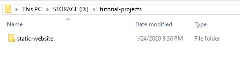

****

# Create the project

## In this lesson, we will create a new project for our website.

### Create a project folder

- On your computer, create a new folder for your project.

- Open Visual Studio Code, and open the folder : **File > Open Folder** and select the folder.

- Close the 'Welcome' screen if it is open.

- You now have a blank folder to add you project files.

****

****

<noscript>Please enable JavaScript to view the <a href="https://disqus.com/?ref_noscript">comments powered by Disqus.</a></noscript>

