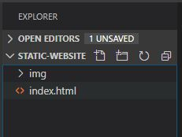
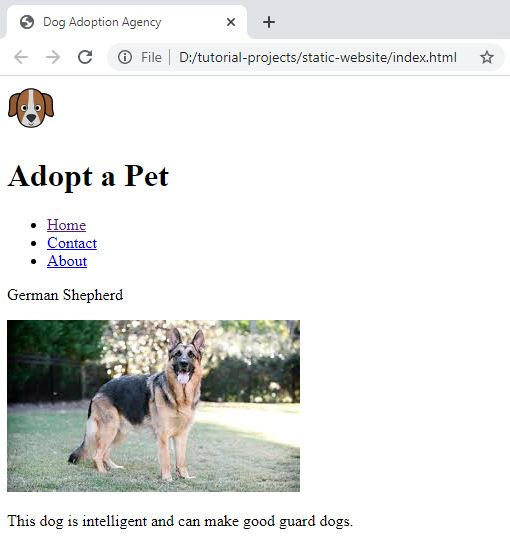

[](https://rclapp.com/mentors.html)

****

# Add Content to an HTML Page

## In this lesson, we will add content to the index.html page.

### Page Preview

- In Visual Studio , click on the **Preview** icon.


- In this way, you can preview the rendered HTML page as you type your code.


### Add Images

- In the project folder, use the new folder icon to add a folder.


- Name the folder **img**.



- Download the .zip folder from this [Tutorial Resources](https://github.com/rcl-coding/tutorial-resources/archive/master.zip) link.

- Unzip the folder and copy the images from the 'static-website' folder to your img folder.


### Header

- Remove the paragraph (**p**) element from the body.

- Add a **header** element in the body as follows :

```html
<!doctype html>
<html lang="en">

<head>
    <meta charset="utf-8">
    <meta name="viewport" content="width=device-width, initial-scale=1, shrink-to-fit=no">
    <meta name="description" content="Adopt a dog from us today">
    <title>Dog Adoption Agency</title>
</head>

<body>
    <!-- Add header -->
    <header>
        
        <h1>Adopt a Pet</h1>
    </header>
</body>

</html>
```

The **header** element contains an image (**img**) element and a text header (**h1**) element.

The **img** has ad **id** attribute set to 'logo' and a **src** (source) attribute set to the relative path of the logo image.

### Navigation 

- Under the header element, add a navigation element (**nav**) as follows :

```html
<!doctype html>
<html lang="en">

<head>
    <meta charset="utf-8">
    <meta name="viewport" content="width=device-width, initial-scale=1, shrink-to-fit=no">
    <meta name="description" content="Adopt a dog from us today">
    <title>Dog Adoption Agency</title>
</head>

<body>
    <header>
        
        <h1>Adopt a Pet</h1>
    </header>
    <!-- Add nav -->
    <nav>
        <ul>
            <li><a href="index.html">Home</a></li>
            <li><a href="contact.html">Contact</a></li>
            <li><a href="about.html">About</a></li>
        </ul>
    </nav>
</body>

</html>
```

The **nav** contains an unordered (**ul**) list (**li**) of links (**a**). 

Notice how the link (**a**) element is nested in each of the list (**li**) elements. 

Each **li** is nested in the **ul**.

These links will comprise the navigation for our website.

### Section

- Under the nav, add a **section** element as follows :

```html
<!doctype html>
<html lang="en">

<head>
    <meta charset="utf-8">
    <meta name="viewport" content="width=device-width, initial-scale=1, shrink-to-fit=no">
    <meta name="description" content="Adopt a dog from us today">
    <title>Dog Adoption Agency</title>
</head>

<body>
    <header>
        
        <h1>Adopt a Pet</h1>
    </header>

    <nav>
        <ul>
            <li><a href="index.html">Home</a></li>
            <li><a href="contact.html">Contact</a></li>
            <li><a href="about.html">About</a></li>
        </ul>
    </nav>
    <!-- Add section -->
    <section>

    </section>

</body>

</html>
```

In the section, add the following code to create a 'pet component' :

```html
<!doctype html>
<html lang="en">

<head>
    <meta charset="utf-8">
    <meta name="viewport" content="width=device-width, initial-scale=1, shrink-to-fit=no">
    <meta name="description" content="Adopt a dog from us today">
    <title>Dog Adoption Agency</title>
</head>

<body>
    <header>
        
        <h1>Adopt a Pet</h1>
    </header>

    <nav>
        <ul>
            <li><a href="index.html">Home</a></li>
            <li><a href="contact.html">Contact</a></li>
            <li><a href="about.html">About</a></li>
        </ul>
    </nav>

    <section>
        <!-- Add 'pet component' -->
        <div id="pet_1">
            <div>
                <p>German Shepherd</p>
                
            </div>
            <div>
                <p>This dog is intelligent and can make good guard dogs.</p>
            </div>
        </div>
    </section>
</body>

</html>
```

We use the **div** (division element) as a container for other elements. 

The outermost div has an **id** attribute set to 'pet_1'. 

We will use  block of code as a 'component' to create containers for the other pets.

Copy the 'pet component' and create containers for the other three pets as follows :

```html
<!doctype html>
<html lang="en">

<head>
    <meta charset="utf-8">
    <meta name="viewport" content="width=device-width, initial-scale=1, shrink-to-fit=no">
    <meta name="description" content="Adopt a dog from us today">
    <title>Dog Adoption Agency</title>
</head>

<body>
    <header>
        
        <h1>Adopt a Pet</h1>
    </header>

    <nav>
        <ul>
            <li><a href="index.html">Home</a></li>
            <li><a href="contact.html">Contact</a></li>
            <li><a href="about.html">About</a></li>
        </ul>
    </nav>

    <section>
        <div id="pet_1">
            <div>
                <p>German Shepherd</p>
                
            </div>
            <div>
                <p>This dog is intelligent and can make good guard dogs.</p>
            </div>
        </div>
        <!-- Add 3 additional 'pet components' -->
        <div id="pet_2">
            <div>
                <p>Bull Terrier</p>
                
            </div>
            <div>
                <p>This dog is kind of dangerous and should be handled by a responsible owner.</p>
            </div>
        </div>

        <div id="pet_3">
            <div>
                <p>Mixed Breed</p>
                
            </div>
            <div>
                <p>This dog is extremely easy to maintain.</p>
            </div>
        </div>

        <div id="pet_4">
            <div>
                <p>Retriever</p>
                
            </div>
            <div>
                <p>This dog is a popular breed and makes a very good pet.</p>
            </div>
        </div>
    </section>
</body>

</html>
```

### Footer

- Add a footer to the page.

```html
<!doctype html>
<html lang="en">

<head>
    <meta charset="utf-8">
    <meta name="viewport" content="width=device-width, initial-scale=1, shrink-to-fit=no">
    <meta name="description" content="Adopt a dog from us today">
    <title>Dog Adoption Agency</title>
</head>

<body>
    <header>
        
        <h1>Adopt a Pet</h1>
    </header>

    <nav>
        <ul>
            <li><a href="index.html">Home</a></li>
            <li><a href="contact.html">Contact</a></li>
            <li><a href="about.html">About</a></li>
        </ul>
    </nav>

    <section>
        <div id="pet_1">
            <div>
                <p>German Shepherd</p>
                
            </div>
            <div>
                <p>This dog is intelligent and can make good guard dogs.</p>
            </div>
        </div>

        <div id="pet_2">
            <div>
                <p>Bull Terrier</p>
                
            </div>
            <div>
                <p>This dog is kind of dangerous and should be handled by a responsible owner.</p>
            </div>
        </div>

        <div id="pet_3">
            <div>
                <p>Mixed Breed</p>
                
            </div>
            <div>
                <p>This dog is extremely easy to maintain.</p>
            </div>
        </div>

        <div id="pet_4">
            <div>
                <p>Retriever</p>
                
            </div>
            <div>
                <p>This dog is a popular breed and makes a very good pet.</p>
            </div>
        </div>
    </section>
    <!-- Add footer -->
    <footer>
        <p>Pet Adoption Agency (c) 2020 </p>
    </footer>
</body>

</html>
```

- Save the file and preview the index.html page in the browser.




****

[](https://rclapp.com/bootcamp.html)

****

<div id="disqus_thread"></div>
<script>
var disqus_config = function () {
this.page.url = 'https://staticwebsite.tutorial.rclapp.com/lessons/lesson3.html';
this.page.identifier = 'a01-03'; 
};
(function() { 
var d = document, s = d.createElement('script');
s.src = 'https://coding-skills-io.disqus.com/embed.js';
s.setAttribute('data-timestamp', +new Date());
(d.head || d.body).appendChild(s);
})();
</script>
<noscript>Please enable JavaScript to view the <a href="https://disqus.com/?ref_noscript">comments powered by Disqus.</a></noscript>

