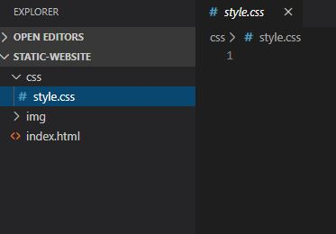
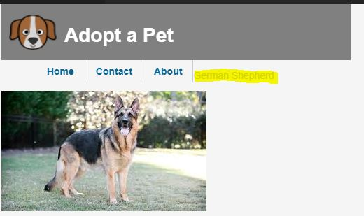
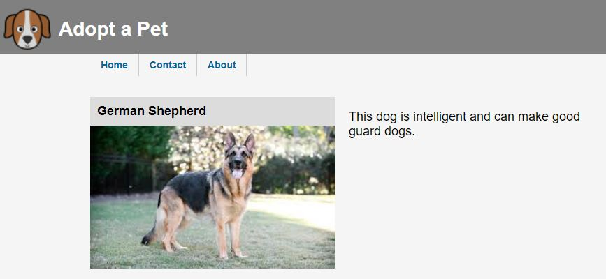
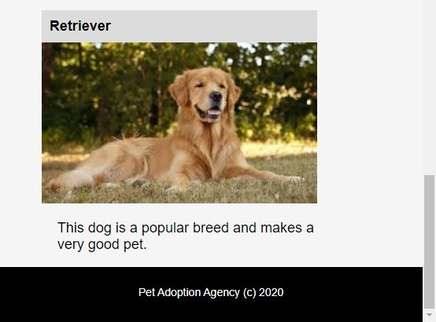

[](https://rclapp.com/mentors.html)

****

# Styling with CSS

## In this lesson, we will use Cascading Style Sheets (CSS) to style our website.

## CSS Folder

- In Visual Studio Code, create a folder for your style sheet. Name the folder **css**.

- In the css folder, add a file named **style.css**.



### Body Style

You can add a style directly to an HTML element using the **element selector**. 

In the style.css file, add style to the **body** element of the HTML page with the following CSS code :

```css
body {
    font-family: Arial, Helvetica, sans-serif;
    font-size: 14px;
    margin: 0px;
    background-color: whitesmoke;
}
```

It sets the font-family, size , margin and background for the page body.

### Apply CSS to HTML

- In the index.html page , add a link to the CSS file in the head section.

```html
<head>
    <meta charset="utf-8">
    <meta name="viewport" content="width=device-width, initial-scale=1, shrink-to-fit=no">
    <meta name="description" content="Adopt a dog from us today">
    <title>Dog Adoption Agency</title>

    <link href="css/style.css" rel="stylesheet" />
</head>
```

- Save the files and , preview the result in the browser.

### Header

- Add the following style for the header section in the page body :

```css
header {
    background-color: grey;
    padding: 10px;
    color: white;
    height: 60px;
}
```

The diagram below illustrates border, padding and margin.


### Logo

- Add the following code to style the logo :

```css
#logo {
    height: 70px;
    width: 70px;
    margin-right: 10px;
    float: left;
}
```

Here, we use the CSS **id selector**. The style will be applied to an html element with the **id** attribute set to 'logo'.

### Navigation

- Style the site navigation with the following code :

```css
nav {
    margin-left: 10%;
}

nav ul {
    list-style: none;
    text-align: center;
    padding: 0;
    margin: 0;
}

nav li {
    float: left;
}

nav li a {
    display: block;
    padding: 8px 15px;
    text-decoration: none;
    font-weight: bold;
    color: #069;
    border-right: 1px solid #ccc;
}

nav li a:hover {
    color: #c00;
    background-color: #fff;
}
```

The left margin of the navigation is set to 10% of the page width using the element selector.

The ul within the nav is set by a **descendent selector**. The 'list-style: none' allow the list element to display horizontally. The list will be floated to the left side of the page.

A descendent selector is also used to set the style of the **a** within each li that is contained in the ul.

The **:hover** selector is used to set the style when you hover over the link.

You will notice that the left float on the li element is being applied to the next element on the page, ie. the section element. We will fix this later on.



### Section

Add the following element selector to style the section element:

```css
section {
    clear: both;
    margin-left: 10%;
    margin-right: 10%;
    padding-top: 10px;
    padding-bottom: 55px;
}
```

The clear property is used to clear the float. This clears the float on both left and right. It will fix the float 'spilling over' from the navigation element.

### Pet Component

- Add the following code to style the 'pet component' :

```css
.card {
    clear: both;
    padding-top: 30px;
}

.card-body {
    float: left;
    width: 350px;
}

.card img {
    width: 350px;
}

.card-title {
    font-size: 18px;
    font-weight: 600;
    background-color: gainsboro;
    padding: 10px;
    margin: 0px;
}

.card-description {
    float: left;
    width: 350px;
    font-size: 18px;
    padding-left: 20px;
}
```

We use the **class** selector to set styling for a class called card. When we add this 'class' attribute to an html element is it will apply the style.

We set the img style with a descendent selector.

We set the style for the card title , card body and card description.

In the index.html page, add the class attributes to the html elements as follows:

```html
<div id="pet_1" class="card">
    <div class="card-body">
        <p class="card-title">German Shepherd</p>
        
    </div>
    <div class="card-description">
        <p>This dog is intelligent and can make good guard dogs.</p>
    </div>
</div>
```

- Set the classes for all the other 'pet components'.

```html
<div id="pet_2" class="card">
    <div class="card-body">
        <p class="card-title">Bull Terrier</p>
        
    </div>
    <div class="card-description">
        <p>This dog is kind of dangerous and should be handled by a responsible owner.</p>
    </div>
</div>

<div id="pet_3" class="card">
    <div class="card-body">
        <p class="card-title">Mixed Breed</p>
        
    </div>
    <div class="card-description">
        <p>This dog is extremely easy to maintain.</p>
    </div>
</div>

<div id="pet_4" class="card">
    <div class="card-body">
        <p class="card-title">Retriever</p>
        
    </div>
    <div class="card-description">
        <p>This dog is a popular breed and makes a very good pet.</p>
    </div>
</div>
```

- Preview the index.html page in the browser and see the results.



### Footer

- Use the element selector to style the footer

```css
footer {
    clear: both;
    background-color: black;
    color: white;
    height: 60px;
    width: 100%;
    text-align: center;
    padding-top: 10px;
    position:fixed;
    bottom:0;
}
```

- Preview the index.html page in the browser and see the results.



****

[](https://rclapp.com/bootcamp.html)

****

<div id="disqus_thread"></div>
<script>
var disqus_config = function () {
this.page.url = 'https://staticwebsite.tutorial.rclapp.com/lessons/lesson4.html';
this.page.identifier = 'a01-04'; 
};
(function() { 
var d = document, s = d.createElement('script');
s.src = 'https://coding-skills-io.disqus.com/embed.js';
s.setAttribute('data-timestamp', +new Date());
(d.head || d.body).appendChild(s);
})();
</script>
<noscript>Please enable JavaScript to view the <a href="https://disqus.com/?ref_noscript">comments powered by Disqus.</a></noscript>


