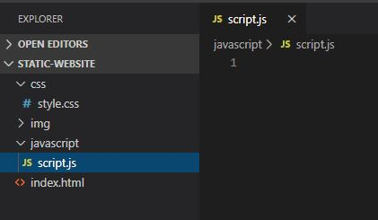
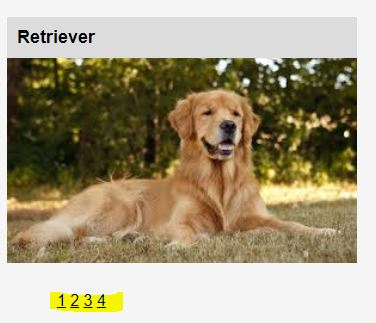

[](https://classroom.github.com/a/8P_h4PsT)

****

# Javascript

## In this lesson, we will add Javascript to a webpage to make it interactive.

### Add a javascript folder

- In the project folder, add a new folder and name it **javascript**.

- In this folder, add a new file called **script.js**



### Image gallery

We will use javascript to build an image gallery in the index.html page.

- In the index.html page, add code for the image gallery controller just before the section closing tag :

```html
....

<div id="gallery-controller">
    <ul>
        <li><a href="#">1</a></li>
        <li><a href="#">2</a></li>
        <li><a href="#">3</a></li>
        <li><a href="#">4</a></li>
    </ul>
</div>

</section>
```

- In the style.css file, add the style for the gallery controller.

```css
#gallery-controller {
    clear: both;
    font-size: 16px;
    padding: 10px;
}

#gallery-controller li {
    display: inline;
}
```

- Save the files and preview the result in the browser.



### Gallery Navigation List

In the script.js file, write a **function** to get access to the navigation element in the gallery controller.

```javascript
function getGalleryNavList()
{
    // Get the gallery controller
    var div_gallery = document.getElementById('gallery-controller');

    // Get the ul element in the gallery controller
    // getElementsByTagName returns an array of elements
    // We must use getElementsByTagName("ul")[0] to get the first ul element in the array
    var nav_list = div_gallery.getElementsByTagName("ul")[0];

    // The function returns the ul element in the gallery controller
    return nav_list;
}
```

- Write a function to hide all the 'pet components' on the page.

```javascript

function hideAllPets() 
{
    // Get the ul element in the gallery controller
    var nav_list = getGalleryNavList();

    // Iterate through the four pets on the page
    for (i = 1; i < 5; i++) 
    {
        // Get the 'pet component' and set the display to none to hide it
        document.getElementById('pet_' + i).style.display = 'none';

        // Get links in the gallery controller and set it to normal font weight
        nav_list.getElementsByTagName("li")[i - 1].style.fontWeight = '400';
    }
}
```

- Write a function to show a 'pet component' when the relevant link is clicked in the gallery controller.

```javascript
function showPet(i) 
{
    // Initially hide all the pets
    hideAllPets();

     // Get the ul element in the gallery controller
    var nav_list = getGalleryNavList();

    // Set the link for the selected pet in the gallery controller to bold
    nav_list.getElementsByTagName("li")[i - 1].style.fontWeight = '800';

    // Show the selected pet
    document.getElementById('pet_' + i).style.display = 'block';
}
```

### Add Javascript to the page

In the index.html page's head section, add a link to your javascript file.

```html
<head>
    <title>Pet</title>
    <link href="css/style.css" rel="stylesheet" />
    <script src="javascript/script.js"></script>
</head>
```

When the page loads, we want to hide all the pets and show the first pet only. 

Add javascript in the body onload event to do this.

```html
<body onload="showPet(1)">
```

When the user clicks a number link in the gallery controller, we want to show the pet with that number. Add the code on each onclick event on the link to do this.

```html
<div id="gallery-controller">
    <ul>
        <li><a onclick="showPet(1)" href="#">1</a></li>
        <li><a onclick="showPet(2)" href="#">2</a></li>
        <li><a onclick="showPet(3)" href="#">3</a></li>
        <li><a onclick="showPet(4)" href="#">4</a></li>
    </ul>
</div>
```

- Save the files and preview the result in the browser.

***
### COMMENTS
***

<div id="disqus_thread"></div>
<script>
var disqus_config = function () {
this.page.url = 'https://staticwebsite.tutorial.rclapp.com/lessons/lesson5.html';
this.page.identifier = 'a01-05'; 
};
(function() { 
var d = document, s = d.createElement('script');
s.src = 'https://coding-skills-io.disqus.com/embed.js';
s.setAttribute('data-timestamp', +new Date());
(d.head || d.body).appendChild(s);
})();
</script>
<noscript>Please enable JavaScript to view the <a href="https://disqus.com/?ref_noscript">comments powered by Disqus.</a></noscript>


