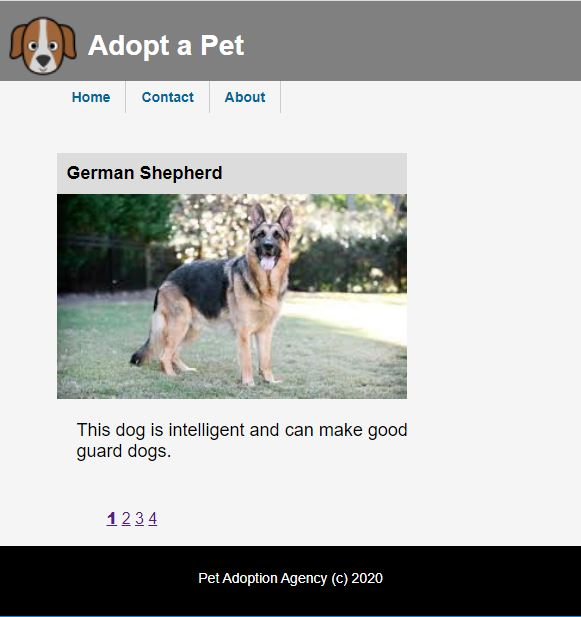

[](https://rclapp.com/mentors.html)

****

# Add Pages to Website

## In this lesson, we will add additional pages to our website.

### About Page

- In the project folder, add a new HTML page named **about.html**.

- Add the code for the page :

```html
<!DOCTYPE html>

<head>
    <meta charset="utf-8">
    <meta name="viewport" content="width=device-width, initial-scale=1, shrink-to-fit=no">
    <meta name="description" content="About the Dog Adoption Agency">
    <title>Dog Adoption Agency - About</title>

    <link href="css/style.css" rel="stylesheet" />
</head>

<body>
    <header>
        
        <h1>Adopt a Pet</h1>
    </header>

    <nav>
        <ul>
            <li><a href="index.html">Home</a></li>
            <li><a href="contact.html">Contact</a></li>
            <li><a href="about.html">About</a></li>
        </ul>
    </nav>

    <section>
        <h1>Pet Adoption Agency</h1>
        <h3>We hope to find a loving home for all our pets.</h3>
        <p>Visit us and find a loyal and loving pet today. You will not regret it.</p>
    </section>

    <footer>
        <p>Pet Adoption Agency (c) 2020 </p>
    </footer>
</body>

</html>
```

### Contact Page

- In the project folder, add a new HTML page named **contact.html**.

- Add the code for the page :

```html
<!DOCTYPE html>

<head>
    <meta charset="utf-8">
    <meta name="viewport" content="width=device-width, initial-scale=1, shrink-to-fit=no">
    <meta name="description" content="Contact the Dog Adoption Agency">
    <title>Dog Adoption Agency - Contact</title>

    <link href="css/style.css" rel="stylesheet" />
</head>

<body>
    <header>
        
        <h1>Adopt a Pet</h1>
    </header>

    <nav>
        <ul>
            <li><a href="index.html">Home</a></li>
            <li><a href="contact.html">Contact</a></li>
            <li><a href="about.html">About</a></li>
        </ul>
    </nav>

    <section>
        <h1>Pet Adoption Agency</h1>
        <p>Email : adoptapet@mail.com</p>
        <p>Telephone: 1-800-321-7654</p>
        <p>Address: 12, Anytown, Anystreet, Anywhere.</p>
    </section>

    <footer>
        <p>Pet Adoption Agency (c) 2020 </p>
    </footer>
</body>

</html>
```

- Save the files and preview the completed website in the browser.



****

[](https://rclapp.com/bootcamp.html)

****

<div id="disqus_thread"></div>
<script>
var disqus_config = function () {
this.page.url = 'https://staticwebsite.tutorial.rclapp.com/lessons/lesson6.html';
this.page.identifier = 'a01-06'; 
};
(function() { 
var d = document, s = d.createElement('script');
s.src = 'https://coding-skills-io.disqus.com/embed.js';
s.setAttribute('data-timestamp', +new Date());
(d.head || d.body).appendChild(s);
})();
</script>
<noscript>Please enable JavaScript to view the <a href="https://disqus.com/?ref_noscript">comments powered by Disqus.</a></noscript>

