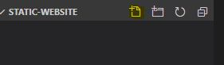
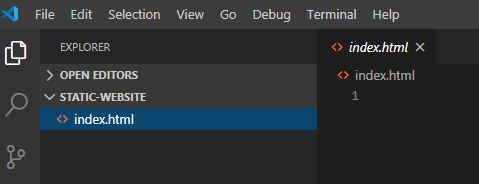
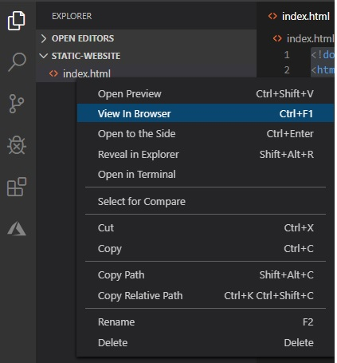
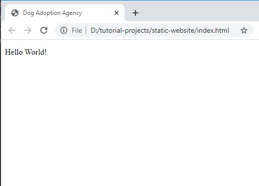

# Add an HTML page

## In this lesson, we will add an HTML file to our project.

### Add an Index.html file

- In the project folder, in Visual Studio Code, click on the **New File** icon and add a new file.



- Name the new file **index.html**.



This file has a special name 'index.html'. When your website first opens, it will look for a file named 'index.html' and open that file. 

This is the 'Front Page' for your website.

### HTML page structure

- Add the following code to your Index.html page :

```html
<!doctype html>
<html lang="en">

</html>
```

An HTML page starts with the **< !doctype html>** declaration. It basically says that this document is an HTML (**HyperText Markup Language**) page.

HTML is a **markup** language and comprise of **elements**.

The index.html page has an **html** element, which starts with an **< html>** starting tag and ends with an **< /html>** ending tag.

**lang** is an **attribute** of the **html** element, in this case, the language is English.

All the elements of an HTML page is placed inside this **html** element between the starting and ending tags.

### Head Section and Meta
- Between the html element's starting and ending tags, add the following code :

```html
<!doctype html>
<html lang="en">

<head>

    <meta charset="utf-8">
    <meta name="viewport" content="width=device-width, initial-scale=1, shrink-to-fit=no">
    <meta name="description" content="Adopt a dog from us today">
    <title>Dog Adoption Agency</title>

</head>

</html>
```

The **Head** section of the page provides information (meta data) about the page. The **meta** elements is used to enter this information. 

The following is a short description of the attributes the meta element :

- charset - the character set used
- viewport - adjust the size of the page to fill small, medium and large screens
- description - the description of the page

The Head element also contains the title of the page in the **title** element.

### Body

- Add the **body** element under the Head element:

```html
<!doctype html>
<html lang="en">

<head>

    <meta charset="utf-8">
    <meta name="viewport" content="width=device-width, initial-scale=1, shrink-to-fit=no">
    <meta name="description" content="Adopt a dog from us today">
    <title>Dog Adoption Agency</title>

</head>

<body>

</body>

</html>
```

- In the body element, add a **P** (paragraph element) with the **caption** shown in the following code :

```html
<!doctype html>
<html lang="en">

<head>

    <meta charset="utf-8">
    <meta name="viewport" content="width=device-width, initial-scale=1, shrink-to-fit=no">
    <meta name="description" content="Adopt a dog from us today">
    <title>Dog Adoption Agency</title>

</head>

<body>
    <p>Hello World!</p>
</body>

</html>

```

The 'Hello World' caption will be displayed on your web page.

### View in the Browser

- In Visual Studio Code, save your file.

- Right click the index.html file and click on **View in Browser**.



- You should see your HTML page rendered in the browser.



